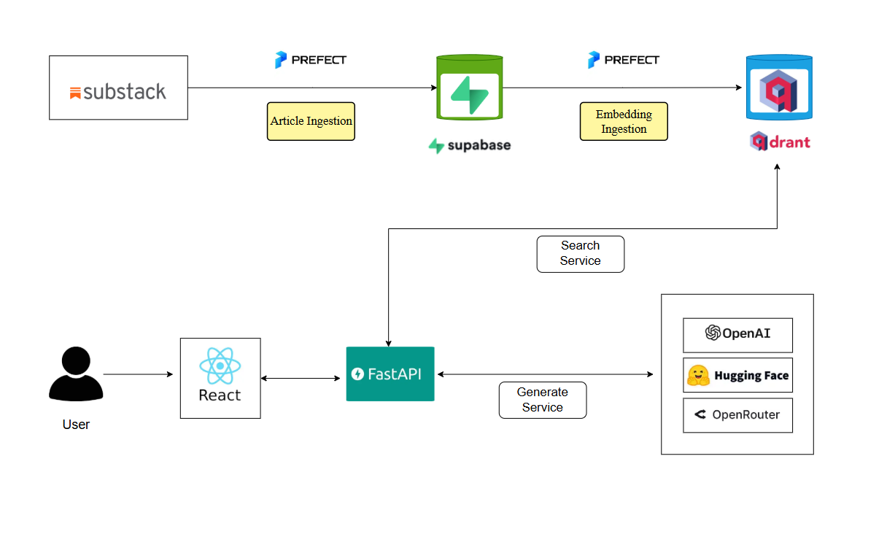

# Retrievix

*A Retrieval-Augmented Engine for searching and answering questions from Substack articles*

[](https://youtu.be/QDUTjjRfQ2g)



<!-- Project Status -->

[](https://www.python.org/downloads/)
[](https://github.com/astral-sh/uv)

<!-- Providers -->

[](https://supabase.com/)
[](https://qdrant.tech/)
[](https://www.prefect.io/)
[](https://fastapi.tiangolo.com/)
[](https://react.dev/)


---

 ## ✨ Overview

This project is a robust Retrieval-Augmented Generation (RAG) system designed to make Substack newsletter content easily searchable and accessible. It automates the ingestion of articles from a curated list of Substack newsletters, leveraging their RSS feeds. Articles are stored in a Supabase PostgreSQL database, while their semantic embeddings are generated and indexed in a Qdrant vector database for efficient similarity search.

The data pipeline is orchestrated using Prefect, enabling scheduled, reliable, and reproducible ingestion and embedding workflows. Prefect ensures that new content is regularly fetched, processed, and made available for search without manual intervention.

The backend is powered by a FastAPI application that exposes a set of RESTful endpoints for querying the ingested articles. Users can:

- **Search for articles by unique titles** (fast, keyword-based, no LLM required)
- **Ask natural language questions** about the ingested articles, with answers generated by LLMs in both streaming and non-streaming modes

Multiple LLM providers are supported, including OpenRouter (default, with a generous free tier), OpenAI, and Hugging Face. For OpenAI and Hugging Face, you will need to supply your own API keys.

For user interaction, this repository includes a React UI for local exploration and prototyping.

---

## 🚀 Features

- 🔍 Semantic search over Substack articles using vector embeddings
- ⚡ Fast keyword-based title search (no LLM required)
- 🤖 RAG-based question answering with streaming support
- 🔄 Automated ingestion pipeline using Prefect
- 🧠 Multi-provider LLM support (OpenRouter, OpenAI, HuggingFace)
- 💾 Hybrid storage: PostgreSQL (Supabase) + Qdrant vector DB
- 🌐 React frontend for interactive querying

---

### ⬇️ Installation

Clone the repository, install dependencies, and set up your environment variables:

```bash

git clone https://github.com/TechFox6905/Retrievix.git
cd Retrievix
uv sync --all-groups

# Windows (cmd)
.venv\Scripts\activate
copy .env.example .env

# Mac/Linux
source .venv/bin/activate
cp .env.example .env

```

```bash

# Create Supabase DB and Qdrant Collection
make supabase-create
make qdrant-create

# Article Ingestion
make ingest-rss

# Embedding Ingestion
make ingest-embeddings

# Backend 
make run-api

# Frontend
cd frontend
copy .env.example .env # (in Frontend)
npm i
npm run dev
```

---


## 📡 API Endpoints

##### Search Titles
`POST /search/titles`

##### Ask Question
`POST /ask`

##### Streaming Response
`POST /ask/stream`

---

## 🧠 Tech Stack

| Service  | Description                           | Docs/Links                                                                  |
| -------- | ------------------------------------- | --------------------------------------------------------------------------- |
| Supabase | PostgreSQL database for articles      | [Supabase](https://supabase.com/docs)                                       |
| Qdrant   | Vector DB for embeddings              | [Qdrant](https://qdrant.tech/documentation/database-tutorials/bulk-upload/) |
| Prefect  | Orchestration for ingestion/embedding | [Prefect](https://docs.prefect.io/)                                         |
| OpenRouter                                    | LLM Provider                        | [OpenRouter](https://www.openrouter.com/)                                   |
| OpenAI, Hugging Face (backup)                 | LLM Provider (backup)               | [OpenAI](https://platform.openai.com/docs/) / [Hugging Face](https://huggingface.co/docs) |
| Docker   | Containerization                      | [Docker](https://docs.docker.com/)                                          |
| FastAPI  | API for querying/search               | [FastAPI](https://fastapi.tiangolo.com/)                                    |
| React   | UI                           | [React](https://react.dev/learn)                                    |
| Opik AI  | LLM evaluation               | [Opik](https://opik.ai/)                                                    |


---

## 🚧 Future Improvements

- Add hybrid ranking (BM25 + vector search)
- Improve chunking strategy
- Add authentication
- Deploy on cloud (Render / AWS)
- Add caching for faster responses
