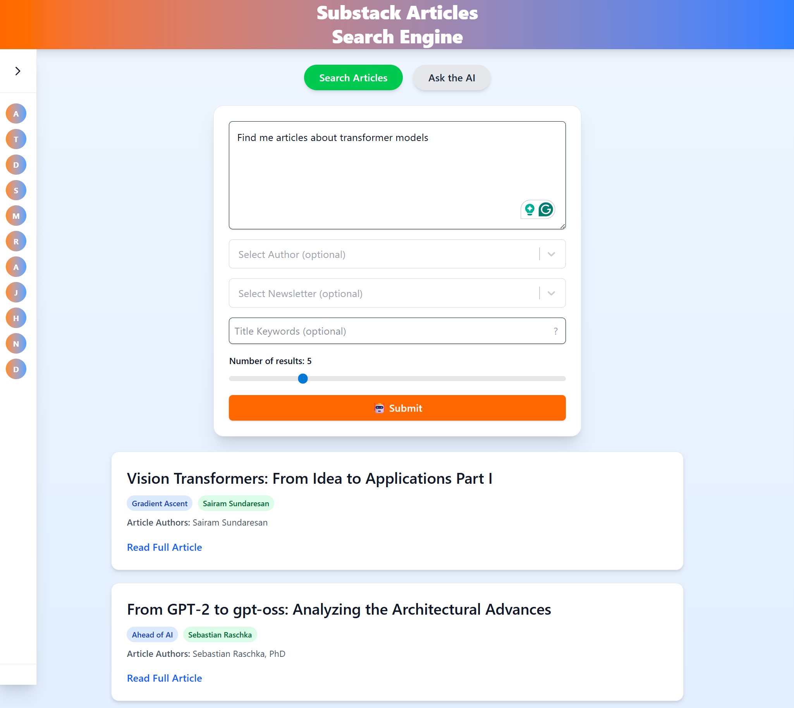

# 📰 Substack Articles Search Engine



This project is a frontend application built with React, TypeScript and Tailwind CSS that allows users to interact with a collection of Substack articles using AI-powered search and question-answering capabilities. The application leverages various AI providers to enhance user experience.

## Table of Contents

- [📰 Substack Articles Search Engine](#-substack-articles-search-engine)
  - [Table of Contents](#table-of-contents)
  - [Project Structure](#project-structure)
  - [Features](#features)
  - [Technologies Used](#technologies-used)
  - [Setup and Installation](#setup-and-installation)
  - [Environment Variables](#environment-variables)
  - [License](#license)

## Project Structure

The project is structured as follows:

```text
substack-react-ui/
├── public/                 # Public assets
├── src/                    # Source files
│   ├── api/                # API service functions
│   ├── components/         # React components
│   ├── data/               # Models and Newsletters data
│   ├── index.css           # Global CSS
│   ├── App.tsx             # Main application component
│   └── main.tsx            # Entry point
├── .env.example            # Example environment variables
├── .gitignore              # Git ignore file
├── index.html              # HTML template
├── package.json            # NPM package configuration
├── tailwind.config.js      # Tailwind CSS configuration
├── tsconfig.app.json       # TypeScript app configuration
└── vite.config.ts          # Vite configuration
```

## Features

- **Search Articles**: Users can search for articles by keywords, authors, and newsletters.
- **AI-Powered Q&A**: Users can ask questions about the articles, and the AI will provide answers based on the content.
- **Multi-Provider Support**: The application supports multiple AI providers from OpenRouter for article retrieval and question answering.

## Technologies Used

- **Frontend**: React, TypeScript, Vite
- **State Management**: React Hooks
- **AI Providers**: OpenRouter (Free)
- **Styling**: Tailwind CSS
- **Backend**: FastAPI (not included in this repo)

## Setup and Installation

1. Clone the repository:

   ```bash
   git clone https://github.com/your-username/substack-react-ui.git
   ```

2. Navigate to the project directory:

   ```bash
   cd substack-react-ui
   ```

3. Install the dependencies:

   ```bash
   npm install
   ```

4. Run locally (development):

   ```bash
   npm run dev
   ```

    The app will be available at: [http://localhost:5173](http://localhost:5173)

5. Build for production:

   ```bash
   npm run build
   ```

6. Preview the production build locally:

   ```bash
   npm run serve
   ```

## Environment Variables

Create a `.env.development` and `.env.production` file in the root directory and add the following environment variables:

**Development (`.env.development`):**

```env
VITE_API_BASE_URL=http://localhost:8000  
```

**Production (`.env.production`):**

```env
VITE_API_BASE_URL=https://your-production-api-url.com
```

## License

This project is licensed under the MIT License - see the [LICENSE](LICENSE) file for details.
